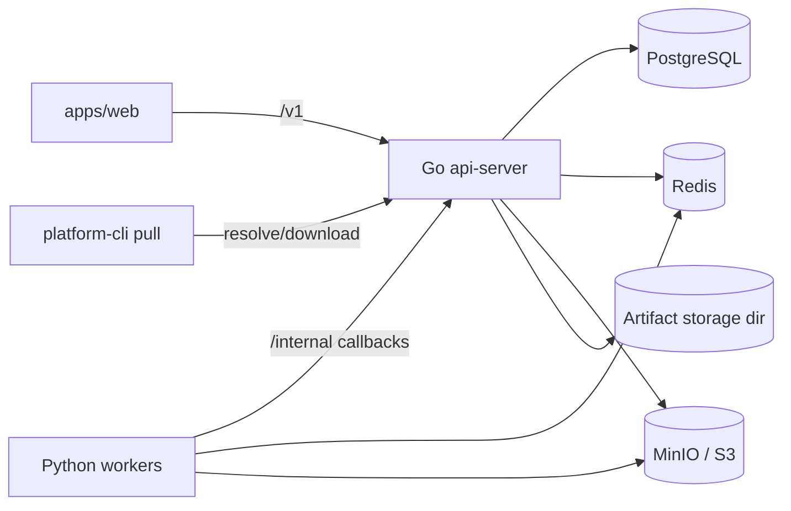

# YOLO-Ave-Mujica 技术审计报告

- 审计日期：2026-04-04
- 审计基线：`096cad995641c7f052e5d730032c4de05c4fd731` 之上的 `.worktrees/codex-phase1-foundation`
- 审计范围：`cmd/`、`internal/`、`workers/`、`apps/web/`、`api/openapi/`、`docs/development/`
- 审计目标：基于当前真实代码与最新验证结果，重新评估项目完成度、稳定性、主要缺口与后续交付风险

## 1. 执行摘要

截至 2026-04-04，项目已经具备可工作的控制面、异步任务、人工标注、审核发布、导出与 CLI 下载主链路。当前工程状态不应再描述为“主干不可编译”或“前端基线损坏”。

最新实测结果如下：

| 项目 | 结果 |
| --- | --- |
| Go 全量测试 | `go test ./...` 通过 |
| Python worker 单测 | 27/27 通过 |
| Web 单测 | 9 个测试文件、28 个用例全部通过 |
| Web 构建 | `npm run build` 通过 |
| Smoke | 当前执行环境缺少 `make`，无法拉起依赖并完成 `scripts/dev/smoke.sh` |

因此当前更准确的判断是：

- 模块级稳定性：高
- 前端基线稳定性：高
- 链路级稳定性：中高，仍需在可用依赖环境中补跑 smoke 与迁移冷启动
- 主要产品缺口：真实零样本执行、真实视频抽帧、COCO export、鉴权审计、可观测性

## 2. 架构与模块现状

系统仍然保持原始设计中的三层结构：

1. Go 控制面：`datahub`、`jobs`、`versioning`、`review`、`tasks`、`overview`、`annotations`、`publish`、`artifacts`
2. Python workers：`importer`、`packager`、`cleaning`、`zero_shot`、`video`
3. Web 与 CLI：`apps/web` 和 `platform-cli pull`

核心依赖关系如下：



## 3. 已完成能力评估

| 模块 | 当前状态 | 质量判断 | 说明 |
| --- | --- | --- | --- |
| `datahub` | 数据集创建、浏览、扫描、快照、对象预签名、导入回调已完成 | B+ | 当前支持 YOLO import 与 COCO import，COCO export 未完成 |
| `jobs` | 任务创建、幂等、lane dispatch、worker callback、lease recovery 已完成 | B+ | 当前已按 `job_type + resource_lane + required_capabilities` 参与执行决策 |
| `tasks` / `overview` | 列表、详情、状态流转、聚合视图已完成 | B | 面向生产的角色约束与报表能力仍缺失 |
| `annotations` | workspace、draft、revision 检查、submit 已完成 | B+ | 当前 worktree 进一步补齐了 `404/409/422` 错误边界 |
| `review` / `publish` | candidate 审核、publish batch、双审批、反馈、record 已完成 | B | 已形成明确工作流，但 published snapshot 语义仍未闭环 |
| `artifacts` | 导出、构建、resolve、presign、download、CLI verify 已完成 | B | builder 仍整块读内存，CLI 仍串行 |
| `apps/web` | Overview、Tasks、Data、Review、Publish、Workspace 已可用 | B | 基线稳定，但尚未接入鉴权与训练/评测页面 |

## 4. 当前 worktree 已完成但未合并的增强

这批改动已经过验证，但仍处于未提交状态：

1. `internal/jobs/*` 新增 typed error，worker callback 现在能稳定区分 `404/409/422`
2. `internal/annotations/*` 新增 typed error，draft / submit / workspace 错误语义更加稳定
3. `internal/datahub/*` 的 snapshot import complete 已区分 `404` 和 `422`
4. `internal/server/http_server_routes_test.go` 新增 OpenAPI 与实际公开路由的一致性守卫
5. `api/openapi/mvp.yaml` 补齐了已存在但此前未登记的 `GET /v1/datasets`、`GET /v1/datasets/{id}`、`GET /v1/snapshots/{id}`
6. `internal/versioning/service.go` 对 exact bbox match 增加索引优化，并补充 benchmark 基线
7. `docs/development/*` 补充了公开 `/v1/*` 与内部 `/internal/*` 的合同治理说明

## 5. 关键差异与旧结论修正

以下旧判断已经不再准确：

1. “主干 Go 构建失败，Web 构建失败”已经过时，当前 worktree 测试与构建全部通过
2. “能力感知调度只持久化未生效”已经过时，当前 [queue_runner.py](/home/shirosora/code_storage/YOLO-Ave-Mujica/.worktrees/codex-phase1-foundation/workers/common/queue_runner.py) 已检查 `job_type`、`resource_lane`、`required_capabilities`
3. “COCO 不支持”表述过于笼统，当前已支持 COCO import，未完成的是 COCO export

仍然成立的缺口有：

1. `workers/zero_shot/main.py` 仍是契约型结果输出，不是真实模型推理
2. `workers/video/main.py` 仍是契约型帧结果输出，不是真实媒体抽帧
3. `internal/artifacts/builder.go` 仍通过 `[]byte` 整块读取源对象
4. `internal/cli/pull.go` 仍是串行拉取与校验
5. `internal/auth/*` 与 `internal/observability/*` 仍不存在

## 6. 风险评估

### 6.1 高风险

1. 真实 AI 与媒体执行尚未落地，当前最核心的产品卖点仍停留在 contract-complete 状态
2. 鉴权、鉴责、审计与可观测性缺失，系统仍更像可信内网控制面而非生产系统

### 6.2 中风险

1. artifact builder 的内存读取路径在大 bundle 下可能成为热点
2. CLI 串行拉取和校验会限制大数据集交付效率
3. COCO export 的产品边界尚未冻结，可能导致合同继续漂移

### 6.3 低到中风险

1. 当前 worktree 改动面较广，需要尽快提交并合并，避免继续堆积
2. smoke 受本地工具链影响未跑完，链路级稳定性仍需在标准环境复核

## 7. 当前优先级建议

建议严格按以下顺序推进：

1. 合并当前 worktree 已验证的 contract hardening 与 route governance 改动
2. 完成真实 zero-shot / video 执行路径
3. 冻结 COCO export 策略并收口 artifact / CLI 交付语义
4. 补齐 auth / audit / observability 基线
5. 最后再推进 training / evaluation / extensibility

## 8. 验收建议

合并前至少完成以下验证：

```bash
GOCACHE=/tmp/go-build GOMODCACHE=/tmp/go-mod go test ./...
PYTHONPATH=. python3 -m unittest discover -s workers/tests -p 'test_*.py' -v
cd apps/web && npm test
cd apps/web && npm run build
```

若环境具备 `make` 和本地依赖，则还应补跑：

```bash
bash scripts/dev/smoke.sh
```

## 9. 审计结论

当前项目最准确的定位不是“还有很多模块没写”，而是“多数主链路已具备工程化基线，真正剩下的是把最重要的产品语义和生产护栏做完”。因此接下来的开发策略不应平均铺开，而应优先收口当前 verified 变更并集中解决真实执行链路。
